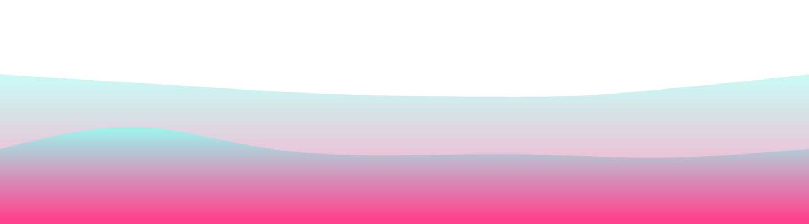

🌱 I’m a full-stack Software Developer
 
💻 Languages: PHP, Typescript, Javascript and C#

 
 

  <h2 id="-socials-">🌐 Socials:</h2>

    

 
 

  <h2 id="-tech-stack-">💻 Tech Stack:</h2>
  
   
   
  

  
  
  
  
  
  
  
  
  
  
  
  
  
  
  
  
  
  

 
 

  <h2>🚀 Github Stats</h2>
  
   
   
  
    
  
    
  

 

